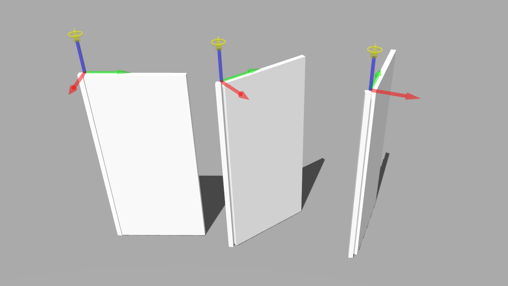
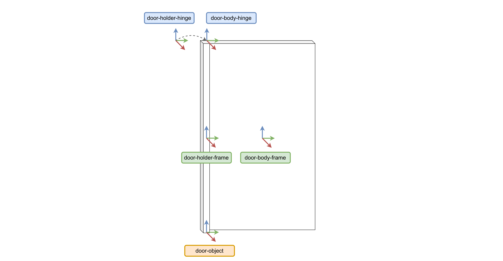
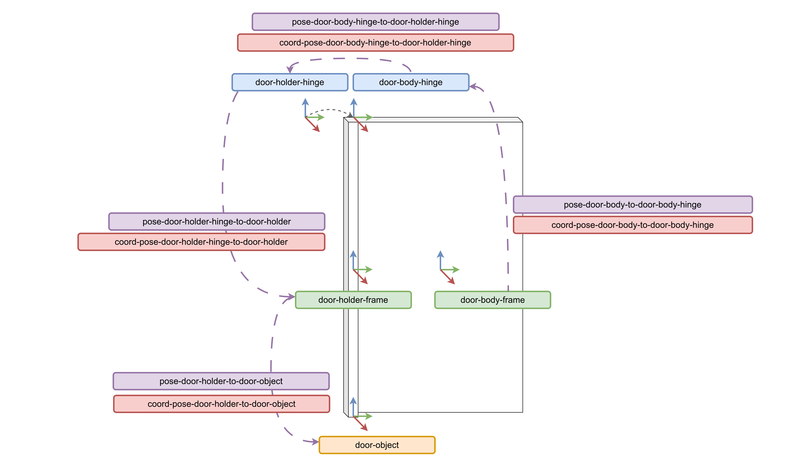
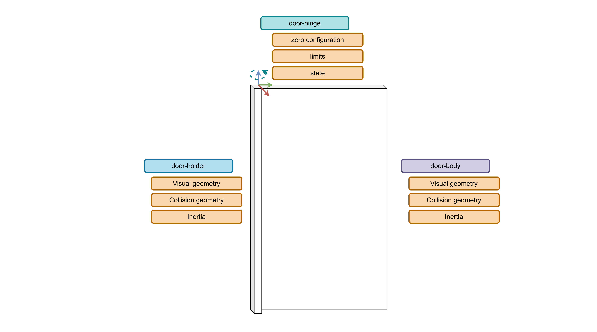
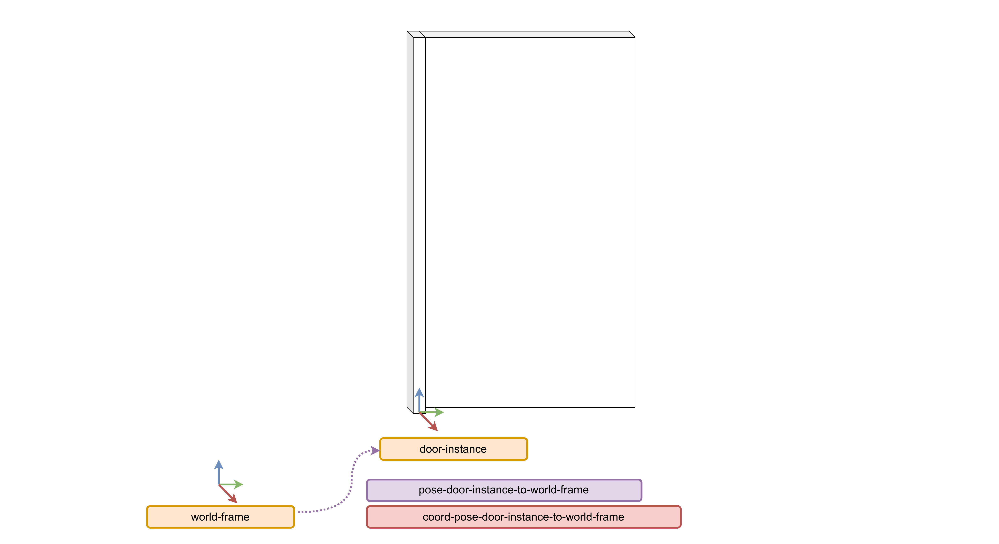

# Tutorials

The objective of the next 3 tutorials is to build an understanding of the composable modelling approach, and how it is used to extend the use case of the FloorPlan DSL. The first tutorial covers the concepts behind modelling a common object with a motion constraint: a door. Then, in the second tutorial we place an instance of the door in the floor plan generated by the FloorPlan DSL. The final tutorial covers the modelling of states, and how we can assign an initial state to a door instance. These tutorials build upon ideas presented in [this tutorial](https://github.com/hbrs-sesame/modelling-tutorial).

## Background 

Composable modelling enables the creation of semantic rich models that are easily extendible and reusable. We use [JSON-LD](https://www.w3.org/TR/json-ld/) to represent our models and metamodels, as the format allows composition by linking models through unique identifiers. Composable models expressed in JSON-LD consist of a `@graph` with elements that conform to one or multiple metamodels, which are specified in a `@context`. Each element is a JSON object with a unique identifier (`@id`), a list of metamodel concepts it conforms to (`@type`), and a set of properties conforming to the metamodel concepts. For example, a composable model of a vector can be modelled by (i) giving the model a unique id, (ii) selecting the list of relevant concepts for a bound vector in 3D space, and (iii) referring to a 3D Point model for the `start` property. This model of a vector can be referred to by its identifier by another model in the graph.

```json
    {
        "@id": "vector-joint-door-hinge-joint-x",
        "@type": [ "3D", "Euclidean", "Vector", "BoundVector", "UnitLength" ],
        "start": "point-door-hinge-origin"
    }
```
The FloorPlan DSL can transform the TextX models into composable models. This has the ability to extend the possible applications for the models. For instance, the tool used in this tutorial is a companion tool that allows to model objects with movement constraints and place them in the indoor environments described in the FloorPlan DSL. This companion tool was developed using the [RDFLib](https://rdflib.readthedocs.io/en/stable/), which is used to navigate the graph and interpret the models. While there is no tutorial on creating such a tool, the companion tool presented in this repository is well documented and can be used as a guide for developing new tools.

The companion tool presented not only consumes the composable models from the FloorPlan DSL, but also re-uses other metamodels from the ExSce workbench in order to model dynamic objects. These are the kinematic chain metamodel and the finite state machine metamodel. The kinematic chain metamodel is used to model the motion constraints of the dynamic objects that will be placed in the indoor environments. Whereas the finite state machine metamodel is used to model the states of these dynamic objects and their transitions. At the moment the states are used to specify the starting state of an object in the simulation. While the robot can interact with these dynamic objects, there is no dynamic change of state based on events or timers.

## How to: Model a Door

||
|:-----------------------:|
|Figure 1: a door model |

A door is an object with a motion constraint. It has a hinge that attaches the door to the doorway, and which constraints its movement to a swing action that allows for opening and closing. In this tutorial we will review the modelling process to create a door with our tool.

A door can be modelled as a kinematic chain, with two links representing the doorway and the door itself. A revolute joint represents the hinge, and it joins the two links and constrains the movement of the door with regards to the doorway.

The first elements to model are the geometric skeleton of the door. Those are points, vectors, and frames. For our door we need to model 5 frames: the `door-object` frame is the root of the object. This frame is later used to specify a pose in the world with an object instance. The door is made up of two links and a joint. Each link can have multiple frames associated with it. In this case, one at the centre of each link (`door-holder-frame` and `door-body-frame`), and two frames of coincident origins for the joint (`door-holder-hinge` and `door-body-hinge`). For these last two, we model the frame not only as an entity with an origin point, but also its three direction vectors. This allows specifying the axis of the joint where the motion is constrained to.

||
|:-----------------------:|
|Figure 2: all the frames required to model the door |

```json
    {
        "@id": "point-joint-door-hinge-origin",
        "@type": [ "3D", "Euclidean", "Point" ]
    },
    {
        "@id": "vector-joint-door-hinge-joint-x",
        "@type": [ "3D", "Euclidean", "Vector", "BoundVector", "UnitLength" ],
        "start": "point-door-hinge-origin"
    },
    // ...
    {
        "@id": "frame-joint-door-hinge",
        "@type": ["3D", "Euclidean", "Frame", "Orthonormal", "RigidBody", "RightHanded", "OriginVectorsXYZ"],
        "origin": "point-joint-door-hinge-origin",
        "vector-x": "vector-joint-door-hinge-joint-x",
        "vector-y": "vector-joint-door-hinge-joint-y",
        "vector-z": "vector-joint-door-hinge-joint-z"
    }
```

These elements are the building blocks for the spatial relations necessary to position the links and joints in space. The pose is specified for each frame with regards to another frame. This representation is coordinate free, as coordinates are associated with another entity that refers to the pose, as shown in this snippet: 

```json
    {
        "@id": "pose-frame-joint-door-hinge-wrt-frame-door-holder-origin",
        "@type": "Pose",
        "of": "frame-joint-door-hinge",
        "with-respect-to": "frame-door-holder-origin",
        "quantity-kind": [ "Angle", "Length" ]
    },
    {
        "@id": "coord-pose-frame-joint-door-hinge-wrt-frame-door-holder-origin",
        "@type": [
            "PoseReference",
            "PoseCoordinate",
            "VectorXYZ"
        ],
        "unit": ["M", "RAD"],
        "of-pose": "pose-frame-joint-door-hinge-wrt-frame-door-holder-origin",
        "as-seen-by": "frame-door-holder-origin",
        "x": -0.025,
        "y": 0.025,
        "z": 0,
        "theta": 0
    }
```
To model the pose of each link and joint, only 4 pose descriptions are necessary, and they are illustrated here:

||
|:----------------------------------:|
|Figure 3: all the pose relations and coordinate references required for the door model|

For each link in the kinematic chain there is also inertia, visual geometry, and collision geometry information that is required. The joint of the door also requires some information about the zero configuration, its maximum and lowest values, and optionally the states that it can be. 

||
|:-------------------------------------------:|
|Figure 4: models required for each link and joint in the kinematic chain|

For the link, modelling the rigid body inertia is straightforward, as it only requires calculating the values. In the simulator, in this case Gazebo, each link is represented visually and physically with a polytope. The polytope can be modelled in various ways. For our example we model the polytope using the `"GazeboCuboid"` type, which describes a cuboid by its length in the x, z, and y directions. We then link this cuboid model to the visual and physics representation of the door body using the `"LinkVisualRepresentation"` and `"LinkPhysicsRepresentation"`.

```json        
    {
        "@id": "inertia-door-body",
        "@type":  [ "RigidBodyInertia", "Mass", "RotationalInertia", "PrincipalMomentsOfInertiaXYZ" ],
        "of-body": "door-body",
        "reference-point": "point-door-body-origin",
        "as-seen-by": "frame-door-body-hinge",
        "quantity-kind": [ "MomentOfInertia", "Mass" ],
        "unit": [ "KiloGM-M2", "KiloGM" ],
        "xx": 0.4069,
        "yy": 0.3322,
        "zz": 0.0751,
        "mass": 1.0
    },
    {
        "@id": "polytope-door-body",
        "GazeboCuboid""@type": ["Polytope", "3DPolytope", "GazeboCuboid"],
        "unit": "M",
        "x-size": 0.05,
        "y-size": 0.93,
        "z-size": 1.98
    },
    {
        "@id": "link-visual-door-body",
        "@type": ["LinkWithPolytope", "LinkVisualRepresentation"],
        "link": "door-body",
        "polytope": "polytope-door-body"
    },
    {
        "@id": "link-physics-door-body",
        "@type": ["LinkWithPolytope", "LinkPhysicsRepresentation"],
        "link": "door-body",
        "polytope": "polytope-door-body"
    }
```
The modelling of the joint and the rest of the kinematic chain is explained in more detail in [this tutorial](https://github.com/hbrs-sesame/modelling-tutorial#kinematic-chain). 

## How to: Place an object in the FloorPlan

||
|:--------------------------------------:|
|Figure 5: frames and pose modelled to place an object instance in the world |

Placing a door instance in the simulation world is simple. We first model a frame with its origin. This frame is co-located with the object frame of the object instance, and by specifying a pose to this frame we can give a pose to the object instance in the world. Modelling a pose works in the same way as in modelling the object: we model a coordinate free pose, and then link to it to specify coordinates. Since we are using the composable models, we can use any frame from the FloorPlan DSL model to specify the pose relation.

```json
    {
        "@id": "pose-frame-location-door-2",
        "@type": "Pose",
        "of": "frame-location-door-2",
        "with-respect-to": "frame-left_long_corridor-wall-1"
    }
```

In our `"ModelInstance"` entity we can link together the instance frame, the object to be instantiated, and in which world it is instantiated. Optionally, we can also specify an initial state for the objects.

```json
    {
        "@id": "door-instance-2",
        "@type": "ObjectInstance",
        "frame": "frame-location-door-2",
        "of-object": "door",
        "world": "brsu_building_c_with_doorways",
    }
```

After running the tool, we obtain the SDF model file for the object, and a world file (also specified in SDF) for Gazebo. 

||
|:----------------------------------:|
| Figure 6: screenshot of Gazebo showing the doors positioned inside the entryways|


## How to: Model a state machine and specify intial states

||
|:--------------------------------------------:|
| Figure 7: finite state machine for a door |

It might be of interest for a test that a door is at a specific state. A finite state machine, such as the one picture above, can be used to model all the states the door can be in and the transitions between them. With kinematic chains, such as the door, the states can refer to joint positions. A fully closed door is a door where the joint position is set to 0 radians, whereas a fully opened door has the joint position set at 1.7 radians. We compose the joints positions with the states model to specify the pose of the door at a specific state. 

||
|:---------------------------------------------:|
| Figure 8: door states with their joint positions |

```json
    {
        "@id": "door-fully-opened",
        "@type": "State"
    },
    {
        "@id": "joint-pose-door-fully-opened",
        "@type": [ "JointReference", "JointPosition", "RevoluteJointPosition", "RevoluteJointPositionCoordinate", "JointLowerLimit" ],
        "of-joint": "joint-door-hinge",
        "quantity-kind": "Angle",
        "unit": "RAD",
        "value": 1.6
    },
    {
        "@id": "joint-state-door-fully-opened",
        "@type": "JointState",
        "joint": "joint-door-hinge",
        "pose": "joint-pose-door-fully-opened",
        "state": "door-fully-opened"
    },
```

With the state definitions, we can now add an initial state to the object instance. This will add a [Gazebo plugin](https://github.com/hbrs-sesame/floorplan-gazebo-initial-state-plugin) to the SDF model so that the door is set up to the correct state at start-up. 

```json
    {
        "@id": "door-instance-2",
        "@type": "ObjectInstance",
        // ...
        "start-state": "door-fully-opened"
    }
```